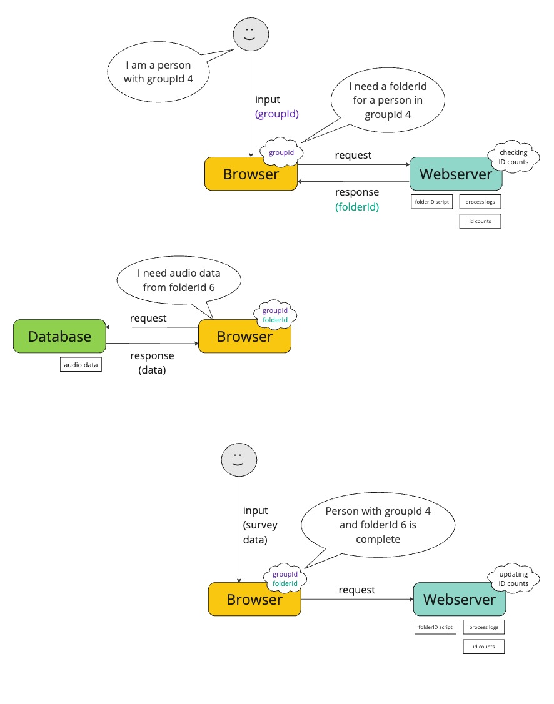

## Group ID Tracker for Online Survey Tools

by Annika Frommholz

This project offers a solution for providing and keeping track of folder and group IDs for the participants of an online survey.

This project was initially implemented by Luzie Ahrens in this [repository](https://git.tu-berlin.de/luzie-ahrens/survey_ids). I extended the functionality. 

### Overview

Sometimes when a questionaire is carried out, only a part of the dataset (for example audios or images) should be processed by the participants X. The completion then has to be distributed equally over all folders N. Additionally participants of different demografic groups N often have to be systematically distributed. This can get very complex very quickly. For example, when 1400 people of 12 different demographic groups have to rate all items from one of 105 different data folders. 
Additionally there is the problem, that some participants start a survey but do not complete it.

Currently, some online survey tools - like LimeSurvey - do not offer a solution for assigning exactly X participants of G groups to one of N folders and only taking into account completed attempts. This project offers a solution.

### Functionality

For the sake of keeping track of IDs as well as giving out new ones, a json file `id_counts.json` is created. Inside this json-file, there is one key for each of the G possible groups, with the value being an array of length N that keeps track of how often this demographic group has completed any folder. The array is initialized with all ones and whenever this group-folder combination is completed the number is decreased. So, folders corresponding to the array index with a `1` have not been completed. Additionally another json-file logs every time an ID has been given out as well as when the survey has been completed and the id count file is updated. 

To get access to a new folder-ID from within another website, a server needs to be set up and run a Node.js application. The application loads the data from the id count json-file and stores it in a dictionary. The app allows HTTPS-requests and - upon an incoming request containing information on the demographic group - checks the dictionary for free folder-IDs for this group. It logs the start of the survey and sends back a HTTPS-response with the new folder-ID in the body. This ID can now be used by the requesting website. I recommend setting a session storage variable with javascript to later on get access to this variable in other tabs and webpages. More explanation about this can be found down below.

When the questionaire is finished, another HTTPS-requests needs to be send to the server in order to confirm that a participant of the given group has used and finished the questionaire with the given folder-ID. In this case, a POST-requests needs to be send from the website with the group-ID in the body. The completion of the survey is logged and the json-file that keeps track of the IDs is then updated and overwritten (with the value of the specified folder-ID within the group array being decreased). More explanation about this can be found down below.

A complete overview of the functionality is provided by the picture below.




### Getting started

First up, you need to set up a server. The server needs to have an SSL-certificate in order to run and serve HTTPS. This is necessary to make requests possible that are coming from within another website (i.e. via javascript). For most browsers to be able to request from your server you also need a domain that forwards requests to your server. Your server also needs to be open for incoming requests on the port you're going to use (default `8000`).
I implemented all of this with [IONOS](https://www.ionos.de/)
1. Hosting a Server: I used a VPS XS (1€/month)
2. Buying a domain and subdomain with an SSL certificate (assign SSL certificate to domain)
3. Enable DNS forwarding from subdomain to IP of VPS (A-Type Record)
4. Open port 8000 for TCP traffic in firewall rules

After you cloned this repository to the server, you need to run `create_id_counts.py` to create the json file `id_count.json`. In the python file, set the variables `num_folders` and `num_groups` to the specific numbers needed for your questionaire.


In the file `run.js`, specify the path to your ssl-key-file (`key: <path>`),  ssl-cert-file (`cert: <path>`) and intermediate ssl-certificate-file (`ca: <path>`).

Make sure you have installed [Node.js](https://nodejs.org/en/download).

Run `npm install` to install the necessary node packages.

Run `node run.js` to start the webserver.

### Requesting new IDs

Once the server is started, you can request new IDs. 

To request IDs from within another website (LimeSurvey in my case), you can use the following Javascript code. You have to define a logic to assign the correct groupID first and include it in the URL as a variable.

```js
// get and store the groupId (important for later)
const groupId = yourGroupIdFunction();
sessionStorage.setItem('groupId', groupId);
// url to fetch ID (replace your-ip-address and port)
const url = "https://your-ip-address:port/?groupId=" + groupId;

fetch(url)
    .then(function(response) {
        return response.json();

    })
    .then(function(data) {
        handleResponse(data);
    })
    .catch(function(err) { 
        console.log('Fetch Error :-S', err); 
    });

// Function to handle response data
function handleResponse(data) {
    const folderId = data.folderId;
    const processId = data.processId;

    // Storing response in session storageto access it within the browser session (later in the survey)
    sessionStorage.setItem('folderId', folderId);
    sessionStorage.setItem('processId', processId);

    // optional: set innerHTML of a given element
    const folderIdElement = document.getElementById("folder_id");
    folderIdElement.innerHTML = folderId;
}

```

### Using your ID to retrieve data from the desired folder

You can use the session storage variable to get your ID again. I used this code when i included the audio file the participants should rate.

The HTML-code for an audio file could look like this:

```HTML
<p><span style="font-size:16px;">Click ► to play.</span></p>

<audio controls="" id="myaudio"><source id="your_audio_source_id" src="" type="audio/mp3" /></audio>
```

The JS that is executed when the question (containing the previous HTML) is shown is this: 

```js
// get ID from session storage
var folderId = sessionStorage.getItem('folderId');

// use variable to get specified audio file from folder
var file = "/upload/surveys/123456/files/" + folderId + "/1.mp3"

// set source of audio element to file
var audio_source_element = document.getElementById("your_audio_source_id");
audio_source_element.src = file;
var audio_source_element = document.getElementById("myaudio");
audio_source_element.src = file;
```


### Confirming the ID has been used

At the very end of your questionaire, you need to let the server know the ID has been used. You can use the following code to send a POST-request to the server.

```js
// url of your server (replace your-ip-address and port)
url = "https://your-ip-address:port"

const folderId = sessionStorage.getItem('folderId');
const processId = sessionStorage.getItem('processId');
const groupId = sessionStorage.getItem('groupId');

// Define the data for the POST request
const postData = {
    folderId: folderId2,
    processId: processId,
    groupId: groupId
};

fetch(url, {
    method: 'POST',
    headers: {
        'Access-Control-Allow-Origin': '*',
        'Content-Type': 'application/json'
    },
    body: JSON.stringify(postData)
})
   .then(response => response.json())
   .then(response => console.log(JSON.stringify(response)))
```

#### What if someone starts the questionaire but doesn't finish?

The server will not know if someone has cancelled the questionaire. All the server knows is that a group-ID has been given out but no confirmation has been received. This is okay, because only upon receival of a confirmation, the ID counter (in the id count json file) will be overwritten. 

#### In what order are the groups filled with participants?

The current implementation detects which folders are not completed for a given group id. from all uncompleted folders it selects one at random. If all folders for a group have been completed is also gives one at random.


##### Contact

Annika Frommholz
Mail: akinna.frommholz@gmail.com